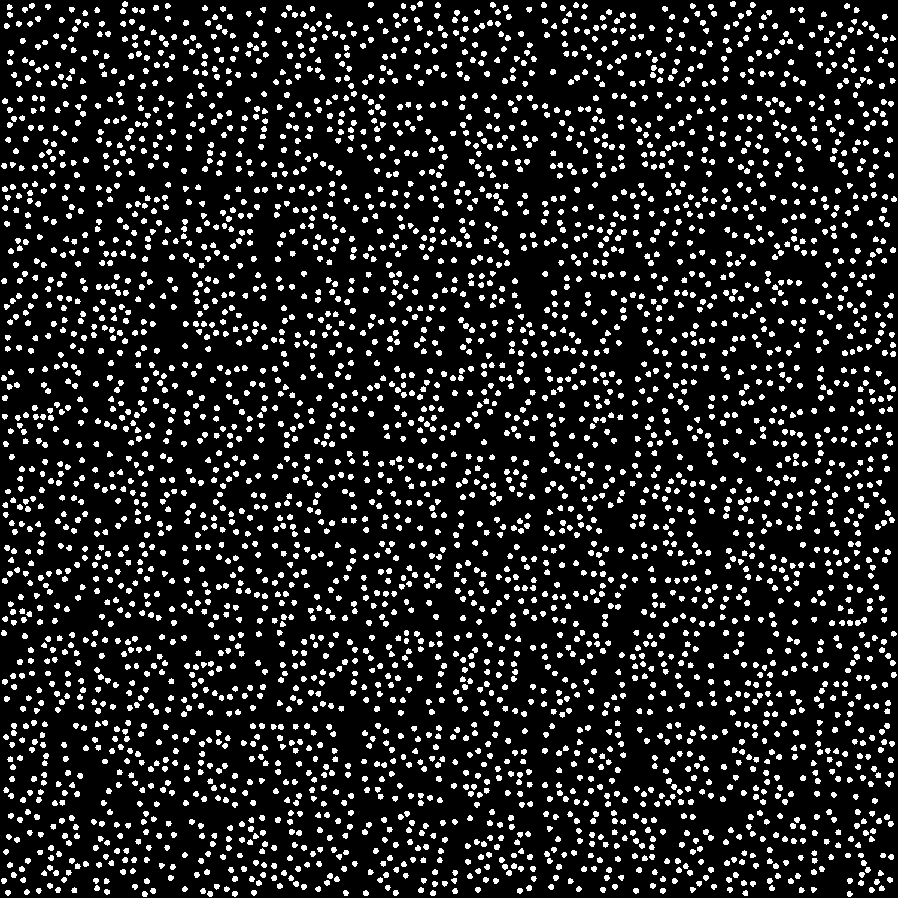
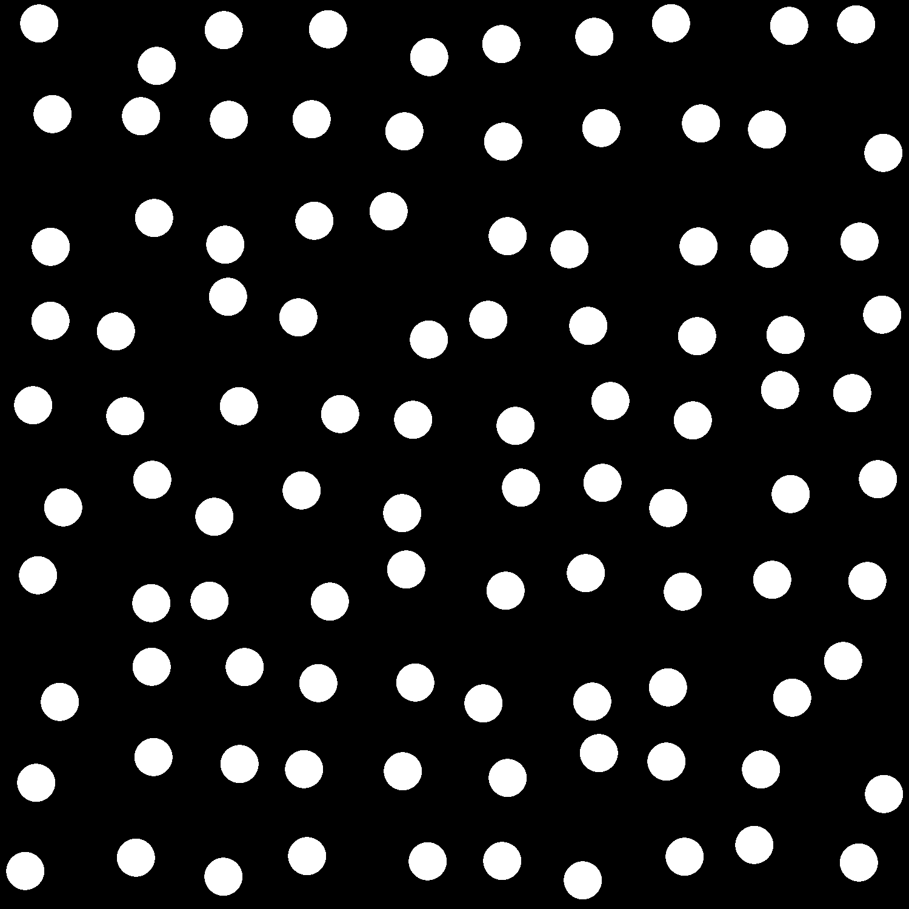
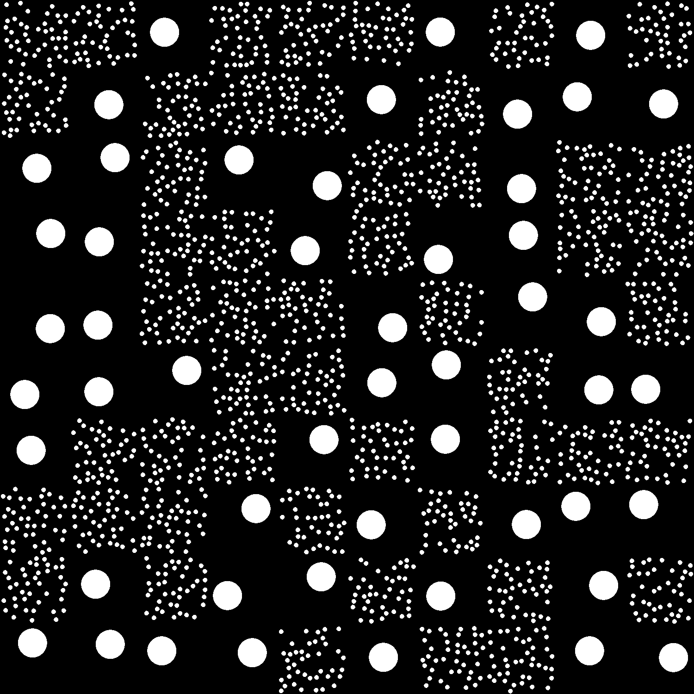
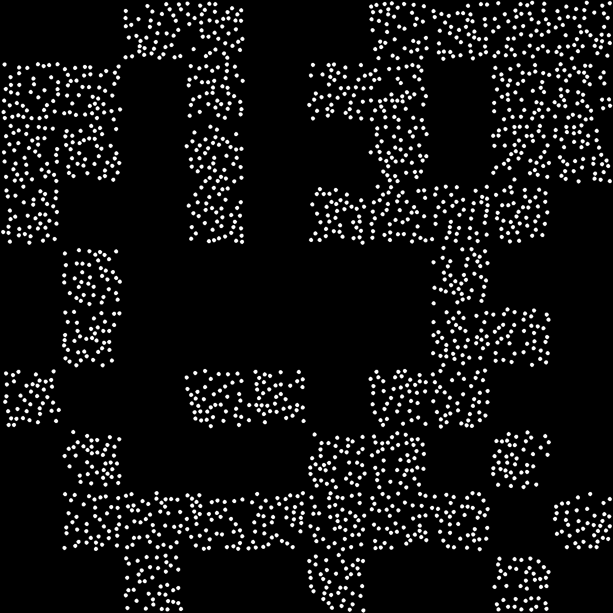

# Quadrats-Distribution

## Introduction

The approach presented her is based on the works performed wthin the EFFISURF project, at both LEPMI laboratory and CT-IPC research center.
See scientific references at the bottom of this page

<table>
    <tr>
        <td>  </td>
        <td>  </td>
        <td> <a href="https://ct-ipc.com/"> </td>
    </tr>
</table>

In order to quantify the distribution and dispersion of nodules in our samples, a custom method to analyze our optical microscopy images was developed. Based on the quadrats method [citations], it allowed us to compare different samples, with variable amount of additive.

## Method
Sample images are first binarized, to obtain nodules as white objects over a black background. A segmentation phase is first conducted to label each nodule and obtain their centroids coordinates, excluding nodules crossing the image edges.

Each image are then divided N times along the X and Y directions, resulting in N2 sub-images, called quadrats.  Each quadrat is analyzed with the following algorithm:

-	The white percentage ___NSP___ is computed
-	The number of nodules ___NBN___ is determined as follows: if the nodule centroid lies within the quadrat,  NBN is incremented
-	The ratio NSP / NBN, called __γ__, is computed. If NBN = 0, no value is returned.

Therefore, a [N,N] array is obtained for each sample image, from which we can plot a heatmap representing __γ__ all over the image.

Synthetic model images were generated to assess the value of our method:
-	_SmallCircles_: each quadrat, denoted S-typed, is composed of 40 circles of radius 10px, randomly placed, without crossing the quadrats borders. The cumulated circles area in each quadrat is denoted A.
-	_BigCircles_: each quadrat, denoted L-typed, is composed of 1 single circle, whose area equals A, randomly placed, without crossing the quadrats borders.
-	_MixCircles_: with either S- and L-typed quadrats, randomly placed
-	_Small_and_No_Circles_: with S-typed and empty quadrats, randomly placed.

<table>
    <tr>
        <td>  </td>
        <td>  </td>
        <td>  </td>
        <td>  </td>
    </tr>
</table>

___NSP___ heatmaps were computed for each image.

<table>
    <tr>
        <td> small </td>
        <td> big </td>
        <td> mix </td>
        <td> smalla and No </td>
    </tr>
</table>

Not surprisingly, ___NSP___ heatmaps for SmallCircles, BigCircles and MixCircles are identical, and are not that useful to discriminate images. 

__γ__ heatmaps were also computed, to take number of nodules into account.

<table>
    <tr>
        <td> small </td>
        <td> big </td>
        <td> mix </td>
        <td> smalla and No </td>
    </tr>
</table>

__γ__ heatmaps for SmallCircles and BigCircles clearly show that spatial distribution all over the image is homogenous, but at a different __γ__ level.
