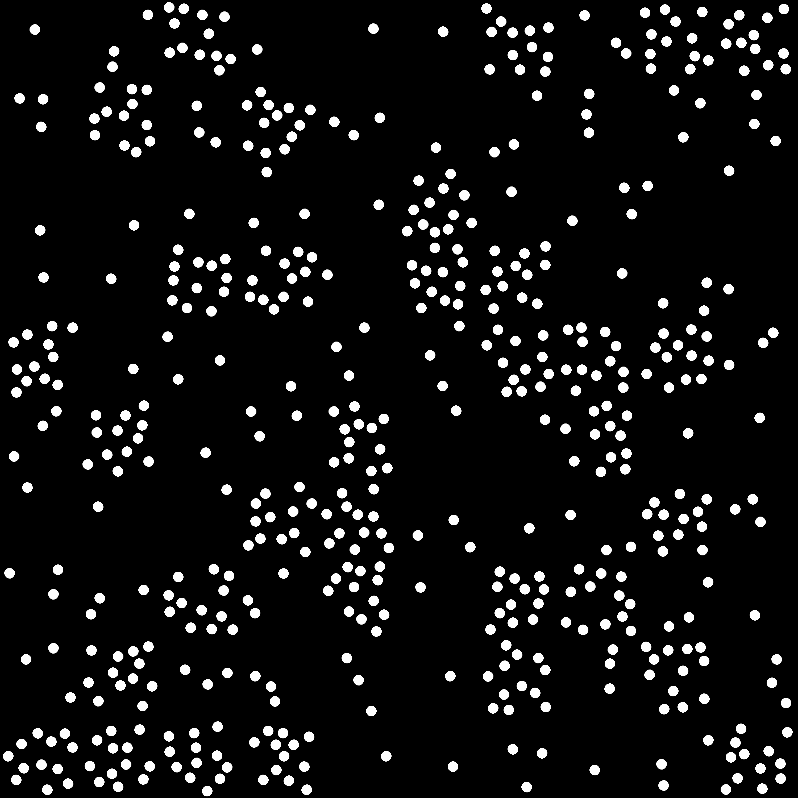
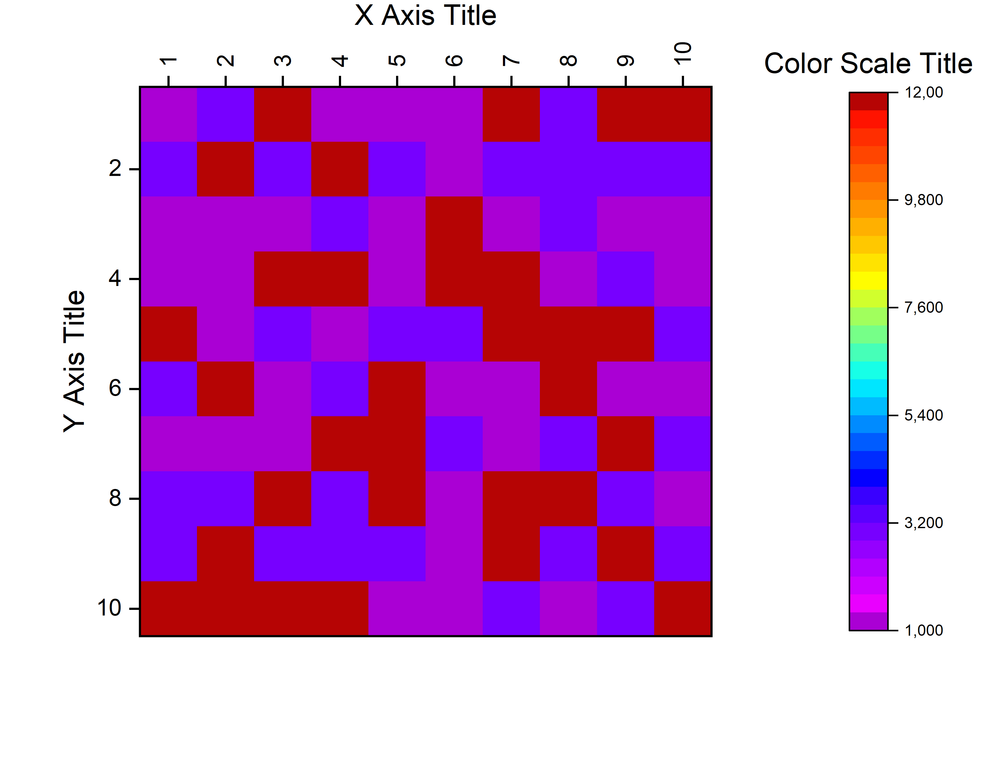
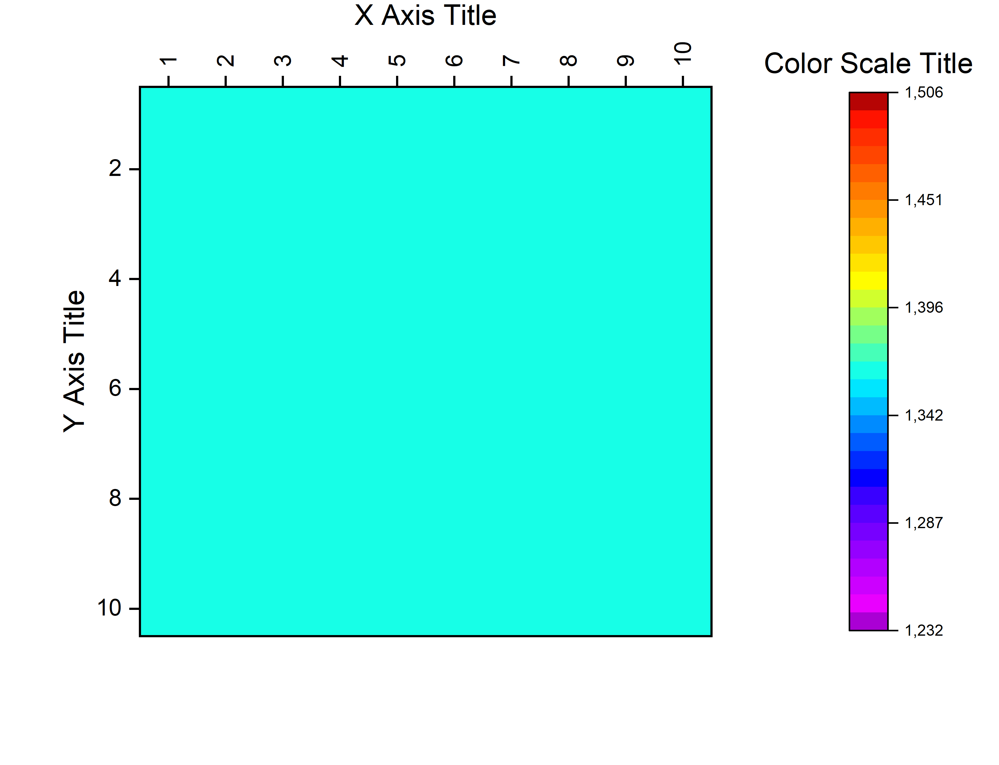

# Quadrats-Distribution

## Introduction

The approach presented here is based on the works performed within the [EFFISURF](https://www.univ-smb.fr/2021/03/02/effisurf-un-projet-destine-a-apporter-de-nouvelles-fonctionnalites-aux-materiaux-plastiques) project, at both LEPMI laboratory and CT-IPC research center.
In particular, the method developed are illustrated in Le Brouster _et al_ (https://pubs.acs.org/doi/10.1021/acsapm.3c01029).
See scientific references at the bottom of this page

<table>
    <tr>
        <td>  </td>
        <td> </td>
        <td> <a href="https://ct-ipc.com/"> </td>
    </tr>
</table>

In order to quantify the distribution and dispersion of nodules in our samples, a custom method to analyze our optical microscopy images was developed. Based on the quadrats method [1], it allowed us to compare different samples, with variable amount of additive.

## Method
Sample images are first binarized, to obtain nodules as white objects over a black background. A segmentation phase is first conducted to label each nodule and obtain their centroids coordinates, excluding nodules crossing the image edges.

[Code and details can be found here](https://github.com/ncharvin/Quadrats-Distribution/tree/main/notebook)

Each image are then divided N times along the X and Y directions, resulting in N2 sub-images, called quadrats.  Each quadrat is analyzed with the following algorithm:

-	The white percentage ___NSP___ is computed
-	The number of nodules ___NBN___ is determined as follows: if the nodule centroid lies within the quadrat,  NBN is incremented
-	The ratio NSP / NBN, called __Fs/n__, is computed. If NBN = 0, no value is returned.

Therefore, a [N,N] array is obtained for each sample image, from which we can plot a heatmap representing __Fs/n__ all over the image.

Synthetic model images were generated to assess the value of our method:
-	_SmallCircles_: each quadrat, denoted S-typed, is composed of 40 circles of radius 10px, randomly placed, without crossing the quadrats borders. The cumulated circles area in each quadrat is denoted A.
-	_BigCircles_: each quadrat, denoted L-typed, is composed of 1 single circle, whose area equals A, randomly placed, without crossing the quadrats borders.
-	_MixCircles_: with either S- and L-typed quadrats, randomly placed
-	_Small_and_No_Circles_: with S-typed and empty quadrats, randomly placed.

<table>
    <tr>
        <td>  </td>
        <td>  </td>
        <td>  </td>
        <td>  </td>
    </tr>
</table>

___NSP___ heatmaps were computed for each image:

<table>
    <tr>
        <td>  </td>
        <td>  </td>
        <td>  </td>
        <td>  </td>
    </tr>
</table>

Not surprisingly, ___NSP___ heatmaps for SmallCircles, BigCircles and MixCircles are identical, and are not that useful to discriminate images. 

__Fs/n__ heatmaps were also computed, to take number of nodules into account:

<table>
    <tr>
        <td>  </td>
        <td>  </td>
        <td>  </td>
        <td>  </td>
    </tr>
</table>

__Fs/n__ heatmaps for SmallCircles and BigCircles clearly show that spatial distribution all over the image is homogenous, but at a different __Fs/n__ level.

## Caveats

Nevertheless, __Fs/n__ cannot be used as a definitive characteristic, as shown on the following synthetic image, with quadrats containing 1, 3 ou 12 similar objects. By definition, if objects presents in image are all similar,  __Fs/n__ does not depend on the number of objects in each quadrat (NBN), which has to be considered separately.
<table>
    <tr>
        <td> Synthetic image </td>
        <td> Nb of nodules  </td>
        <td> NSP </td>
        <td>  <b>Fs/n</b> </td>
    </tr>
    <tr>
        <td> s/n__" width=200> </td>
        <td> s/n__   Nb Nodules" width=200> </td>
        <td> s/n__   NSP" width=200> </td>
        <td> s/n__" width=200> </td>
    </tr>
</table>

## References

[1] Rogers (1977) : [Statistical Analysis of Spatial Dispersion: A Quadrat Method](https://www.jstor.org/stable/2286951), ___Journal of the American Statistical Association___.

