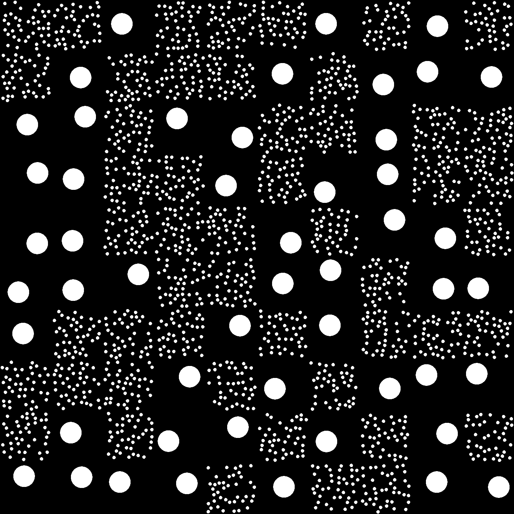

# Microscopy images analysis, based on quadrats method

We will be using the following modules:
* [NumPy](https://scikit-image.org)
* [scikit-image](https://numpy.org)
* [Matplotlib](https://matplotlib.org/)


```python
import numpy as np
import skimage
import matplotlib.pyplot as plt
```

Let's start with the following binarized image:



```python
im = skimage.io.imread("MixCircles.png")   #white objects over black background
Xmax = im.shape[1]-1
Ymax = im.shape[0]-1
```

## Segmentation
We perform segmentaiton on the image, and add a label to each object found. Objects crossing image borders are dismissed. Informations about each object are gathered in a dict.


```python
labels = skimage.morphology.label(im)
labels = skimage.segmentation.clear_border(labels)

table = skimage.measure.regionprops_table(labels, properties=('label','centroid','area'))

xcentroids,ycentroids = table['centroid-1'], table['centroid-0']
```

## Quadrats
The image is split N times along the X and Y directions, resulting in N<sup>2</sup> rectangular regions, called quadrats.


```python
N = 10
quadrat_xsize = int(im.shape[1] / N)
quadrat_ysize = int(im.shape[0] / N)

# Display image

fig,ax = plt.subplots()
skimage.io.imshow(im)  

# Plots quadrats
for i in range(N):
    for j in range(N):
        x0,y0 = i*quadrat_xsize, j*quadrat_ysize
        #plt.plot(x0,y0,'r*')
        ax.add_patch(plt.Rectangle((int(x0),int(y0)), int(quadrat_xsize), int(quadrat_ysize), edgecolor='pink', fill=False))

```


```python

```
