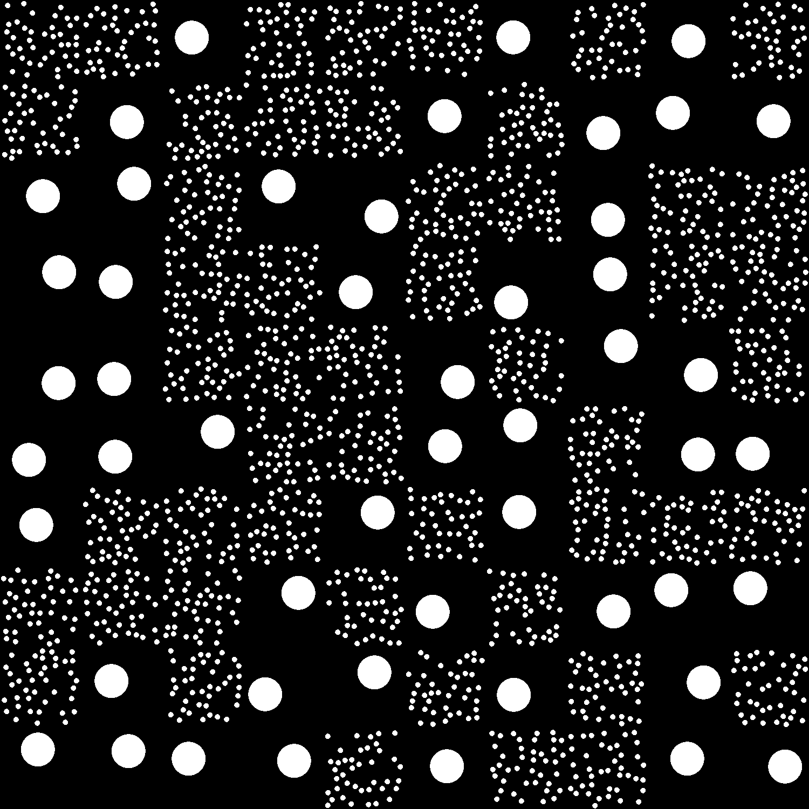
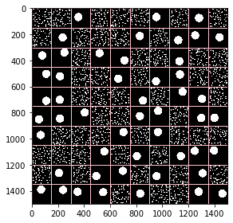
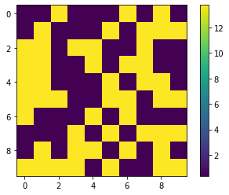

# Microscopy images analysis, based on quadrats method

We will be using the following modules:
* [NumPy](https://scikit-image.org)
* [scikit-image](https://numpy.org)
* [Matplotlib](https://matplotlib.org/)


```python
import numpy as np
import skimage
import matplotlib
import matplotlib.pyplot as plt
```

Let's start with the following binarized image:




```python
im = skimage.io.imread("MixCircles.png")   #white objects over black background

Xmax = im.shape[1]-1
Ymax = im.shape[0]-1
```

## Segmentation
We perform segmentaiton on the image, and add a label to each object found. Objects crossing image borders are dismissed. Informations about each object are gathered in a dict.


```python
labels = skimage.morphology.label(im)
labels = skimage.segmentation.clear_border(labels)

table = skimage.measure.regionprops_table(labels, properties=('label','centroid','area'))

xcentroids,ycentroids = table['centroid-1'], table['centroid-0']
```

## Quadrats
The image is split N times along the X and Y directions, resulting in N<sup>2</sup> rectangular regions, called quadrats.


```python
N = 10
quadrat_xsize = int(im.shape[1] / N)
quadrat_ysize = int(im.shape[0] / N)

# Display image

fig,ax = plt.subplots()
skimage.io.imshow(im)  

# Plots quadrats
for i in range(N):
    for j in range(N):
        x0,y0 = i*quadrat_xsize, j*quadrat_ysize
        #plt.plot(x0,y0,'r*')
        ax.add_patch(plt.Rectangle((int(x0),int(y0)), int(quadrat_xsize), int(quadrat_ysize), edgecolor='pink', fill=False))

```


    

    


For each quadrat, let's compute:
* NSP, the white surface percentage of the image
* NBN, the of nodules. Note that nodule belongs to a quadrat, if and only if the nodule centroid lies within the quadrat borders
* Gamma, which equals to NSP / NBN. 


```python
def insideBBox(x,y,xbox,ybox,width, height):
    """
    return True if point (x,y) is inside boundingbox located at (xbox,ybox)
    and whose size is width and height
    """
    inX = (x>=xbox) and (x<(xbox+width))
    inY = (y>=ybox) and (y<(ybox+height))
    
    return (inX and inY)


NBN_values=np.zeros((N,N))
NSP_values=np.zeros((N,N))
Gamma_values=np.zeros((N,N))


for i in range(N):
    for j in range(N):
        
        # quadrat origin coordinates
        x0,y0 = i*quadrat_xsize, j*quadrat_ysize
        im_quadrat = im[int(y0):int(y0+quadrat_ysize),int(x0):int(x0+quadrat_xsize)]

        # White percentage
        NSP = (im_quadrat.sum()/255)  / (im_quadrat.shape[0]*im_quadrat.shape[1]) * 100
        NSP_values[i,j]=NSP
        
        
        # Number of nodules
        NBN = 0
        for xc,yc in zip(xcentroids, ycentroids):
            if insideBBox(xc, yc, x0, y0, quadrat_xsize, quadrat_ysize):
                NBN +=1
        
        NBN_values[i,j]=NBN
                
                
        # Gamma
        if NBN != 0:
            Gamma_values[i,j] = NSP / NBN
        else:
            Gamma_values[i,j] = np.nan

            
```


```python
fig,ax = plt.subplots()
current_cmap = matplotlib.cm.get_cmap('hot').copy()
current_cmap.set_bad(color='red')
plt.imshow(Gamma_values.transpose())
plt.colorbar()
```


    <matplotlib.colorbar.Colorbar at 0x271348e3e08>


    

    
